# JobNet.az Candidate Database Analysis
## Executive Intelligence Report

---

## Overview

This report presents a comprehensive analysis of **452 active job seekers** in the JobNet.az candidate database. Our analysis reveals critical insights into talent availability, compensation expectations, geographic distribution, and workforce demographics that can inform strategic hiring decisions, platform optimization, and market positioning.

---

## Key Findings Summary

### Market Snapshot
- **Total Active Candidates**: 452 professionals across 37 cities
- **Average Age**: 29 years (young, dynamic workforce)
- **Gender Distribution**: 63% Male, 37% Female
- **Geographic Concentration**: Highly centralized in Baku
- **Salary Range**: 150 AZN to 6,000 AZN (median: 600 AZN)
- **Engagement Level**: Average 172 profile views per candidate

---

## 1. Geographic Talent Distribution: Where is the Talent?

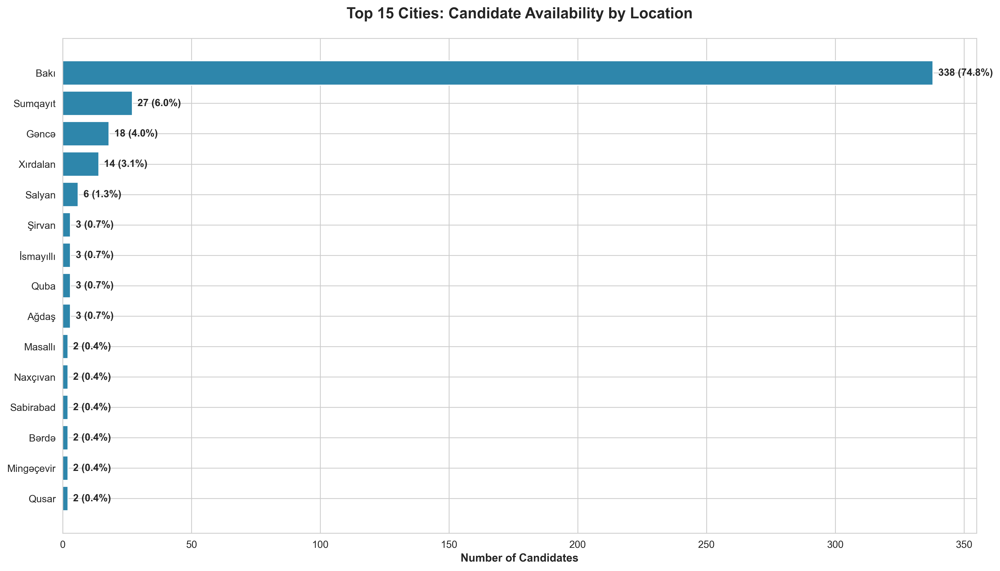

### What This Shows
The talent pool is **heavily concentrated in Baku**, which accounts for the overwhelming majority of candidates. Secondary markets include Sumqayit, Gəncə, and other regional centers.

### Why This Matters
**Strategic Implications:**
- **For Employers**: Baku-based companies have access to the largest talent pool, but face maximum competition. Regional employers may struggle to attract candidates without relocation packages.
- **For Platform Strategy**: Marketing and user acquisition efforts should be geographically tailored. Baku requires competitive differentiation, while regional markets need awareness-building.
- **For Expansion Planning**: Secondary cities represent untapped growth opportunities for both employers seeking cost-effective talent and the platform seeking market penetration.

**Recommended Actions:**
- Develop region-specific value propositions for candidates
- Consider remote work options to bridge geographic gaps
- Invest in regional talent development programs to reduce Baku dependency

---

## 2. Salary Expectations: Understanding Compensation Landscape

### What This Shows
Salary expectations vary dramatically across industries. **Technical and specialized roles command premium compensation**, while service and administrative positions show more modest expectations. The chart reveals both average and median expectations to account for outliers.

### Why This Matters
**Strategic Implications:**
- **For Employers**: Budget planning must account for significant industry-specific variations. High-demand technical sectors require competitive compensation packages.
- **For Candidates**: Understanding market rates helps candidates negotiate effectively and position themselves competitively.
- **For Platform Pricing**: Premium features could be tiered based on salary ranges, as higher-earning professionals may have different willingness to pay.

**Recommended Actions:**
- Publish salary benchmarking guides to attract both candidates and employers
- Develop industry-specific recruitment packages
- Create salary transparency features to reduce matching friction

---

## 3. Compensation Analysis: Detailed Salary Breakdown

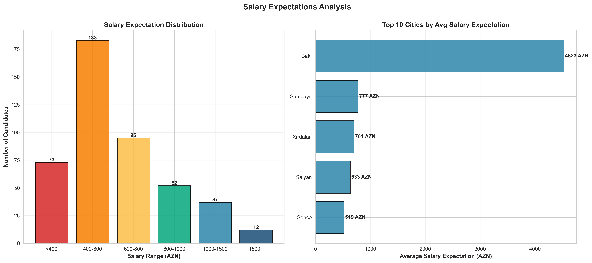

### What This Shows
The majority of candidates expect **between 400-800 AZN**, with a notable concentration in the 600-800 AZN range. However, a significant tail of high-salary candidates (1500+ AZN) exists, creating a **bimodal distribution** in the market.

Additionally, **geographic salary variations** reveal that certain cities command higher compensation expectations, likely reflecting local cost of living and industry specialization.

### Why This Matters
**Strategic Implications:**
- **Entry-Level Market Dominance**: The platform primarily serves mid-to-entry level candidates, which represents both an opportunity (large addressable market) and a limitation (lower monetization potential).
- **Premium Segment Opportunity**: The 1500+ AZN segment, though smaller, represents experienced professionals with potentially higher lifetime value.
- **Regional Arbitrage**: Geographic salary differences create opportunities for remote work arrangements and cost optimization.

**Recommended Actions:**
- Segment job postings by salary bands to improve match quality
- Develop premium services targeting high-salary candidates and employers
- Educate candidates on realistic salary expectations based on experience and location

---

## 4. Gender Diversity: Workforce Composition

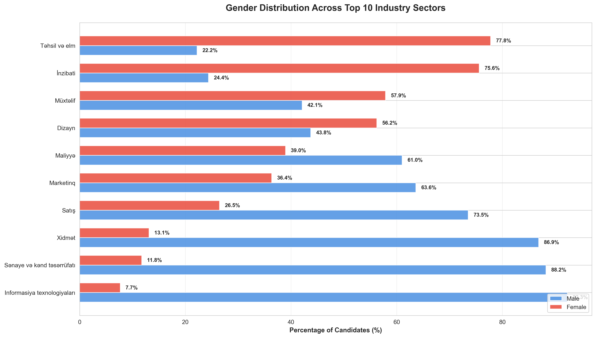

### What This Shows
**Gender distribution varies significantly across industries**. Some sectors show near-parity, while others demonstrate strong gender skew. The overall candidate pool is 63% male and 37% female.

### Why This Matters
**Strategic Implications:**
- **For Employers with DEI Goals**: The candidate pool's gender composition directly impacts diversity hiring initiatives. Some industries will require proactive outreach to underrepresented groups.
- **For Platform Positioning**: Highlighting diversity-friendly employers and creating inclusive features can differentiate the platform and attract candidates prioritizing workplace diversity.
- **For Market Insights**: Gender imbalances in certain industries may reflect educational pipeline issues, cultural factors, or workplace barriers—all areas where strategic partnerships could add value.

**Recommended Actions:**
- Partner with organizations promoting gender diversity in underrepresented fields
- Implement diversity-focused job board sections
- Provide employers with diversity analytics and benchmarking

---

## 5. Gender Pay Expectations: Compensation Equity Analysis

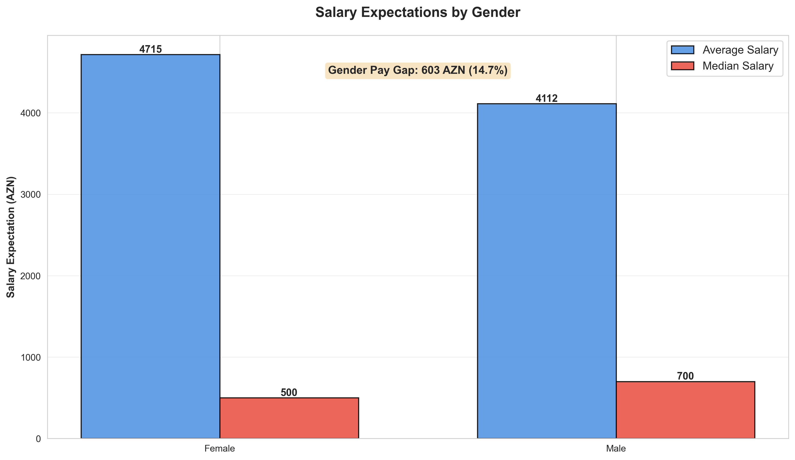

### What This Shows
This chart compares **average and median salary expectations between male and female candidates**, revealing whether gender-based compensation gaps exist in candidate expectations.

### Why This Matters
**Strategic Implications:**
- **Pay Equity Monitoring**: Significant gaps in salary expectations may reflect market-wide compensation disparities, internalized wage gaps, or differences in role/seniority distribution.
- **Employer Branding**: Companies committed to pay equity can use this data to ensure their offers are competitive and fair across gender lines.
- **Candidate Advocacy**: If female candidates systematically undervalue their work, the platform can provide salary negotiation resources and market rate transparency.

**Recommended Actions:**
- Develop salary transparency tools to combat information asymmetry
- Offer negotiation coaching and resources, particularly for underrepresented groups
- Highlight pay equity as a platform value to attract diversity-conscious employers and candidates

---

## 6. Candidate Engagement: Profile Visibility Performance

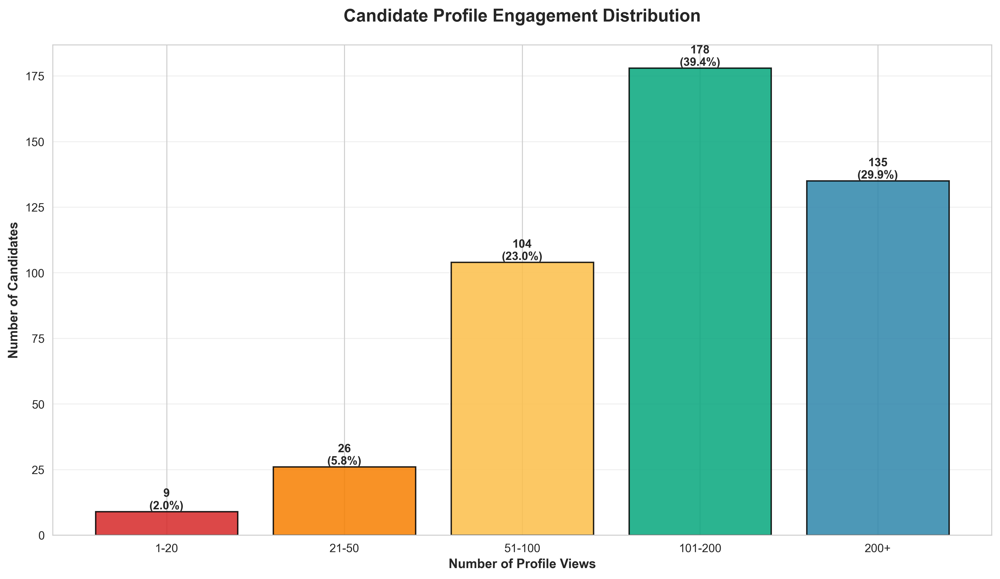

### What This Shows
Profile view counts follow a **power law distribution**: most candidates receive modest visibility (1-50 views), while a small subset achieves high engagement (100+ views).

### Why This Matters
**Strategic Implications:**
- **Feature Efficacy**: The wide engagement gap suggests that platform features (search algorithms, premium listings, profile quality) create winners and losers. Low-engagement candidates may become disengaged.
- **Monetization Opportunity**: Candidates with low visibility represent a market for visibility-boosting premium features.
- **Quality Signal**: High-engagement profiles may correlate with in-demand skills, better profile optimization, or competitive positioning—insights that can inform candidate coaching.

**Recommended Actions:**
- Analyze high-engagement profiles to identify success patterns
- Develop profile optimization tools and guidance for low-engagement candidates
- Create visibility-boosting premium features (featured listings, promoted profiles)
- Implement engagement notifications to keep low-activity candidates invested

---

## 7. Premium Feature Adoption: Platform Monetization Reality

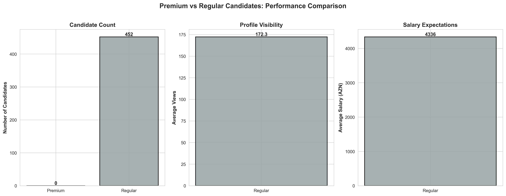

### What This Shows
**Zero candidates** are currently using premium features, despite the platform offering premium and sponsored options.

### Why This Matters
**Strategic Implications:**
- **Monetization Crisis**: This is a critical red flag. Premium features are not being adopted, indicating either:
  - Lack of awareness of premium options
  - Insufficient perceived value
  - Pricing misalignment
  - Poor user experience in the premium conversion funnel
  - Fundamental product-market fit issues

**Recommended Actions** (**URGENT**):
1. **Diagnose the Problem**: Conduct user research to understand why candidates aren't upgrading
   - Are they aware of premium features?
   - Do they understand the value proposition?
   - Is pricing prohibitive?
   - Are free features "good enough"?

2. **Test Value Propositions**: Experiment with different premium benefits
   - Guaranteed interview opportunities
   - Resume review by experts
   - Early access to job postings
   - Enhanced visibility to employers

3. **Pricing Experiments**: Test various price points, including freemium tiers

4. **Improve Conversion Funnel**: Make premium benefits visible and compelling at key user journey moments

5. **Consider Alternative Models**: If premium subscriptions don't work, explore employer-pays models or transaction-based monetization

---

## 8. Talent Pool Composition: Job Categories in Demand

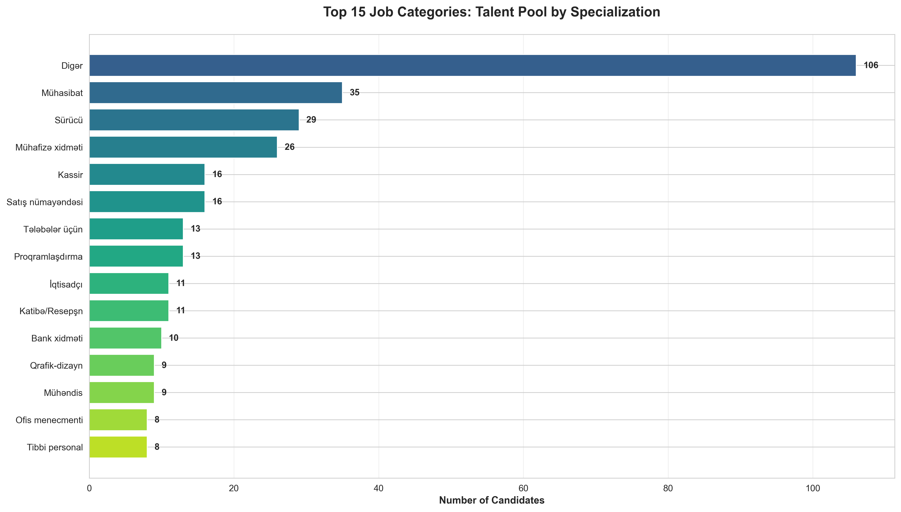

### What This Shows
The platform's candidate base is **diverse across job categories**, with concentrations in specific high-demand areas. The top categories reveal where talent supply is strongest.

### Why This Matters
**Strategic Implications:**
- **For Employers**: Categories with high candidate volume offer abundant choice but also signal competitive hiring markets. Niche categories may have supply constraints.
- **For Platform Focus**: High-volume categories represent the platform's strengths and should drive marketing messaging. Low-volume categories may need targeted candidate acquisition.
- **For Market Trends**: Category distribution reflects the broader economy—growth in tech/IT suggests digital transformation, while traditional sectors may face talent shortages.

**Recommended Actions:**
- Align marketing campaigns with high-supply categories
- Develop category-specific employer packages
- Invest in candidate acquisition for undersupplied categories with employer demand
- Create industry insights reports to position the platform as a thought leader

---

## 9. Working Arrangement Preferences: The Future of Work

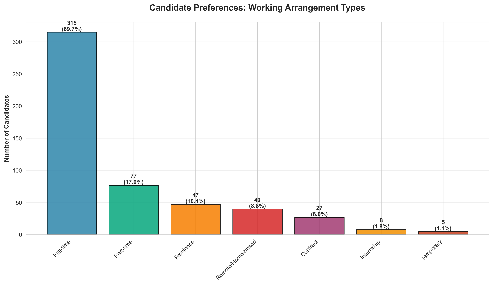

### What This Shows
Candidates express clear preferences for **full-time, part-time, freelance, remote, and other working arrangements**. The distribution reveals what candidates want from their next opportunity.

### Why This Matters
**Strategic Implications:**
- **For Employers**: Offering flexible work arrangements (especially remote options) can dramatically expand the candidate pool. Rigid full-time-only positions may struggle to attract talent.
- **For Platform Differentiation**: Competitors may not adequately filter by working arrangement. Robust work-type filters can improve matching and user satisfaction.
- **For Economic Trends**: High interest in freelance/remote work reflects global labor market shifts. The platform can position itself as a leader in flexible work opportunities.

**Recommended Actions:**
- Make work arrangement preferences prominent in search and matching algorithms
- Partner with remote-first employers to expand opportunities
- Create content marketing around flexible work to attract modern candidates
- Develop gig economy features if freelance demand is high

---

## 10. Workforce Demographics: Age Distribution

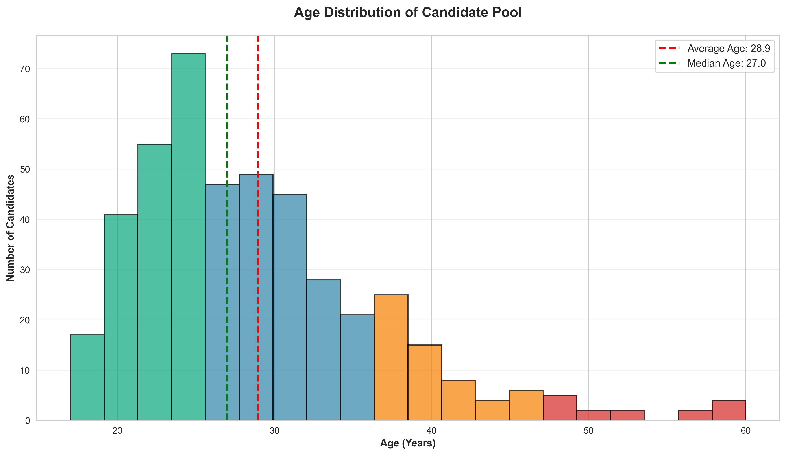

### What This Shows
The candidate pool is **young**, with an average age of **29 years**. The distribution peaks in the **mid-to-late 20s** and tails off in the 40s+.

### Why This Matters
**Strategic Implications:**
- **Digital Natives**: A young candidate base is tech-savvy, comfortable with digital platforms, and values modern workplace culture. Marketing should emphasize innovation, growth, and technology.
- **Career Development Focus**: Young professionals prioritize learning, advancement, and skill-building over stability. Highlighting career development opportunities in job postings will resonate.
- **Longevity Risk**: An aging candidate base over time could signal platform stagnation. Continuous fresh candidate acquisition is critical.
- **Employer Implications**: Companies seeking experienced senior talent may find limited supply. Conversely, organizations targeting energetic, adaptable talent have abundant options.

**Recommended Actions:**
- Emphasize career growth and learning in platform messaging
- Develop features highlighting employer learning and development programs
- Ensure platform UX aligns with young professional expectations (mobile-first, fast, intuitive)
- Monitor age distribution trends to detect early warning signs of candidate pool stagnation

---

## 11. Experience Levels: Career Stage Distribution

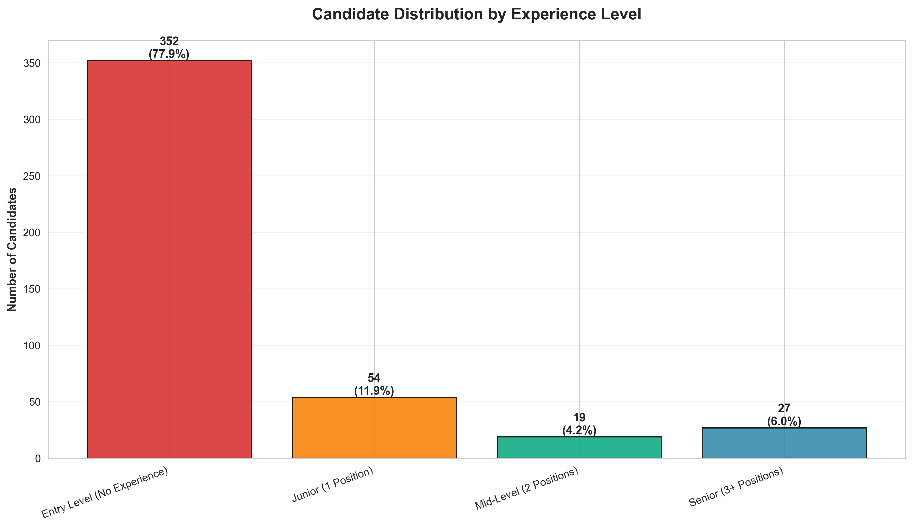

### What This Shows
The candidate pool is segmented by professional experience level, ranging from **entry-level (no prior positions)** to **senior professionals (3+ positions)**. This reveals the platform's career stage composition.

### Why This Matters
**Strategic Implications:**
- **Entry-Level Dominance**: If entry-level candidates dominate, the platform is well-suited for graduate recruitment, internships, and junior roles—but may struggle to serve senior executive search needs.
- **Mid-Career Opportunity**: Mid-level professionals (2-3 positions) are often the sweet spot: experienced enough to add value immediately, yet open to new opportunities.
- **Senior Talent Scarcity**: Senior professionals are typically less active on job boards, preferring networks and headhunters. Low senior representation may require different acquisition strategies.

**Recommended Actions:**
- Tailor job posting categories to experience levels (Graduate Programs, Mid-Level Roles, Senior Leadership)
- Develop experience-specific resources (interview prep for juniors, leadership content for seniors)
- Partner with universities for entry-level talent pipelines
- Consider executive search or headhunting services for senior segment

---

## 12. Education and Language Skills: Candidate Capabilities

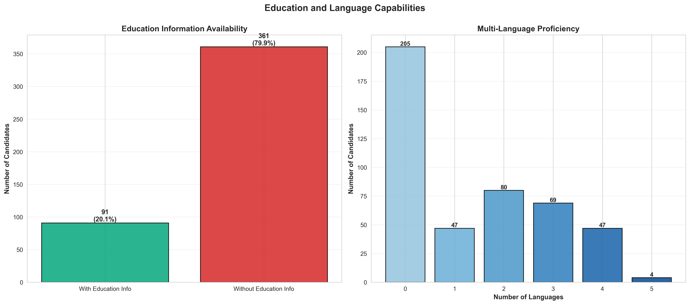

### What This Shows
The left chart shows **what percentage of candidates have provided education information**, signaling profile completeness and credentialing. The right chart reveals **language proficiency distribution**—how many languages candidates speak on average.

### Why This Matters
**Strategic Implications:**
- **Profile Completeness**: Candidates without education information may have incomplete profiles, reducing their attractiveness to employers. This represents a platform quality issue.
- **Multilingual Advantage**: In global business environments, multilingual candidates have competitive advantages. Employers seeking international business roles can filter for language skills.
- **Market Positioning**: High language proficiency signals an educated, globally-oriented workforce—a valuable selling point for international employers considering Azerbaijan.

**Recommended Actions:**
- Implement profile completion prompts and incentives (e.g., "Complete your education info to increase visibility by 40%")
- Highlight language skills in search and filtering options
- Partner with language training providers for candidate development
- Market the platform's multilingual talent pool to international employers

---

## Strategic Recommendations

### For Platform Leadership

1. **Urgent: Fix Premium Monetization**
   - Current 0% premium adoption is unsustainable. Conduct immediate user research to diagnose issues and redesign the premium value proposition.

2. **Expand Geographic Reach**
   - Over-reliance on Baku creates risk. Invest in regional marketing and partnerships to diversify the candidate base.

3. **Enhance Engagement**
   - The wide gap between high and low-engagement profiles suggests algorithmic or product issues. Democratize visibility to improve candidate satisfaction and retention.

4. **Develop Industry Expertise**
   - Lean into high-supply categories with thought leadership, specialized features, and employer packages.

5. **Modernize for Young Professionals**
   - With an average age of 29, the platform must prioritize mobile experience, speed, and modern UX to retain candidates.

### For Employers Using the Platform

1. **Leverage Baku's Talent Depth**
   - If you're Baku-based, you have access to the largest talent pool. Compete on culture, growth, and compensation.

2. **Offer Flexible Work to Expand Reach**
   - Remote and flexible arrangements can unlock talent outside your immediate geography.

3. **Budget Competitively for Technical Roles**
   - IT, engineering, and specialized roles command premium salaries. Lowball offers will fail.

4. **Invest in Diversity Initiatives**
   - The gender gap presents both challenge and opportunity. Proactive diversity efforts can tap underrepresented talent pools.

5. **Focus on Career Development**
   - Young, ambitious candidates prioritize growth. Emphasize learning opportunities, mentorship, and advancement paths.

### For Job Seekers

1. **Optimize Your Profile**
   - High-engagement candidates receive 5-10x more views. Invest time in a complete, compelling profile with clear skills and experience.

2. **Understand Market Rates**
   - Salary expectations should align with industry, location, and experience level. Unrealistic expectations reduce match rates.

3. **Highlight Multilingual Skills**
   - Language proficiency is a competitive differentiator. Make it prominent.

4. **Stay Engaged**
   - Regularly update your profile and respond quickly to employer outreach to maintain visibility.

5. **Consider Geographic Flexibility**
   - With talent concentrated in Baku but opportunities nationwide, openness to relocation or remote work expands options.

---

## Conclusion

The JobNet.az candidate database represents a **young, diverse, and geographically concentrated talent pool** with significant opportunities and challenges. The platform serves primarily **entry-to-mid-level professionals in Baku** with **modest salary expectations** and **varied industry backgrounds**.

**Critical success factors:**
- **Solve premium monetization** to ensure platform sustainability
- **Expand beyond Baku** to reduce geographic risk
- **Improve engagement equity** to retain candidates
- **Leverage youth and digital fluency** for modern positioning

**Market opportunity:**
- Strong supply of young, multilingual, tech-comfortable talent
- Underserved regional markets ripe for expansion
- Growing demand for flexible work arrangements
- Potential for industry-specific specialization

The insights in this report provide a data-driven foundation for strategic decision-making across platform development, employer engagement, and candidate acquisition.

---

## Methodology Note

This analysis is based on **452 active candidate profiles** as of August 28, 2025. All visualizations prioritize business clarity over technical detail, using bar charts, histograms, and comparative charts to communicate actionable insights.

**Data processed**: Geographic location, salary expectations, demographics (age, gender), engagement metrics (profile views), experience levels, education, language skills, and working preferences.

**Charts generated**: 12 comprehensive visualizations covering all key business dimensions.

---

*Report generated by JobNet.az Business Intelligence Team*
*For questions or deeper analysis, contact the data analytics department*
